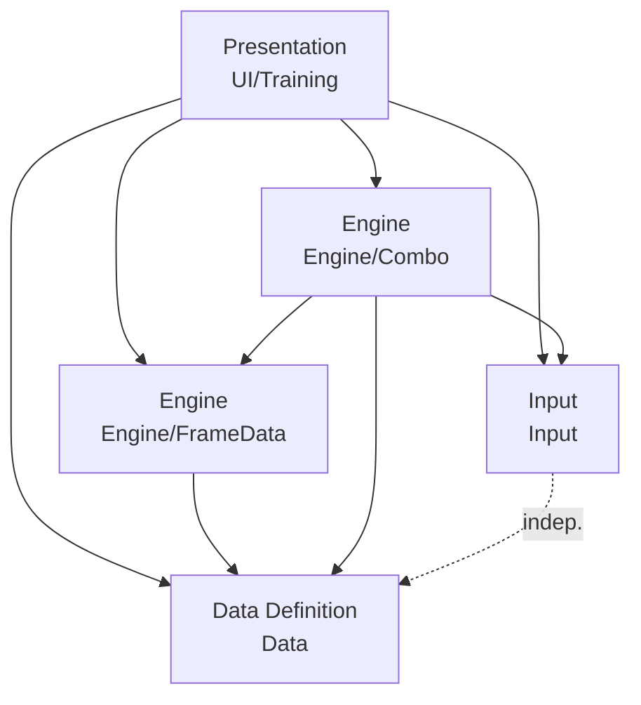
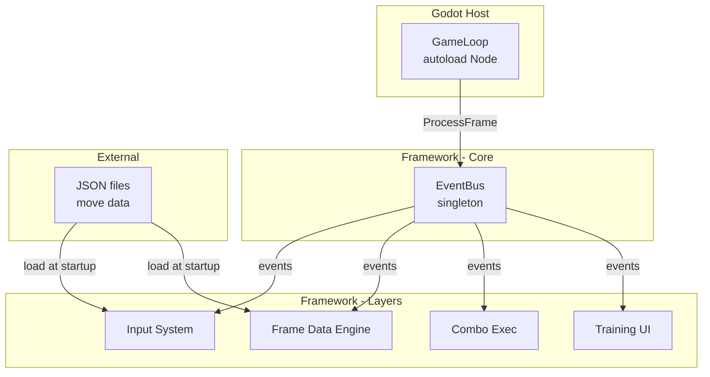

# Architecture Spine — FTG Framework V1

## Design Paradigm

**Layered Architecture.** Four layers, strict downward dependency. Upper layers read lower layers; no lower layer knows about any upper layer. Same-layer modules communicate only through the EventBus — never by direct method call.



| Layer | Namespace | Role |
|-------|-----------|------|
| Presentation | `FTG_Framework.UI.Training` | Read-only observer; renders frame data panel, input log, hitbox overlay |
| Engine | `FTG_Framework.Engine.FrameData`, `FTG_Framework.Engine.Combo` | Game logic; frame timing, cancel detection, combo state machine |
| Data Definition | `FTG_Framework.Data` | Pure data; move definitions, Gatling tables, configuration — loaded from JSON, immutable after load |
| Input | `FTG_Framework.Input` | Input history storage; direction + button tracks, buffer, charge state |

Shared: `FTG_Framework.Core` — EventBus singleton, interfaces, base types. All layers reference Core.

## Invariants & Rules

### AD-1 — Layered Architecture

- **Binds:** all modules
- **Prevents:** circular dependencies, same-layer direct coupling, UI mutating engine state
- **Rule:** Dependency direction is strictly downward. `using` statements must follow: UI → Engine → Data → Input. Same-layer modules (Engine/FrameData, Engine/Combo) communicate exclusively via EventBus events. Core is the only namespace referenced by all layers.

### AD-2 — Directory & Namespace Layout

- **Binds:** all modules
- **Prevents:** ad-hoc file placement breaking layer boundaries
- **Rule:** Every source file lives under `Scripts/Framework/{layer}/`. Namespace mirrors directory. Layer boundaries are enforced by the directory tree — a file in `Engine/` that imports from `UI/` is a build error.

```text
Scripts/Framework/
  Core/           # EventBus, IModule, base exceptions
  Input/          # InputBuffer, InputHistory, ChargeTracker, InputLeniencyMatcher
  Data/           # MoveDefinition, GatlingTable, MoveDataLoader, IDataStore
  Engine/
    FrameData/    # FrameDataEngine, CancelWindowTracker, MoveTimeline
    Combo/        # ComboExecutor, ChainValidator, ComboStateTracker
  UI/
    Training/     # FrameDataPanel, AdvantageDisplay, InputLog, PlaybackControls, HitboxOverlay
```

### AD-3 — Event-Driven Communication

- **Binds:** all modules
- **Prevents:** direct method calls between modules creating invisible coupling; order-of-initialization bugs
- **Rule:** All cross-module communication goes through `EventBus` (singleton, pure C#, in `FTG_Framework.Core`). Modules `Publish<T>(T event)` and `Subscribe<T>(Action<T> handler)`. The EventBus has no knowledge of any module. Event types are plain C# structs/records defined in Core.

**Event catalog (V1):**

| Event | Publisher | Subscribers |
|-------|-----------|-------------|
| `InputReceived` | Input System | Combo Exec, UI |
| `InputBufferExpired` | Input System | Combo Exec |
| `ChargeStateChanged` | Input System | Combo Exec |
| `MoveFrameChanged` | Frame Data Engine | Combo Exec, UI |
| `CancelWindowEntered` | Frame Data Engine | Combo Exec, UI |
| `CancelWindowExited` | Frame Data Engine | Combo Exec, UI |
| `HitConnected` | Frame Data Engine | Combo Exec, UI |
| `MoveBlocked` | Frame Data Engine | Combo Exec, UI |
| `ComboStarted` | Combo Exec | UI |
| `MoveCanceled` | Combo Exec | Frame Data Engine, UI |
| `ComboEnded` | Combo Exec | UI |
| `FrameAdvanced` | EventBus | Input System, Frame Data Engine |

### AD-4 — Frame Processing Order

- **Binds:** GameLoop, EventBus, all modules
- **Prevents:** non-deterministic event ordering within a single frame; timing-dependent bugs
- **Rule:** Within one `ProcessFrame()` call, events are dispatched in fixed order: (1) `FrameAdvanced`, (2) Input System events, (3) Frame Data Engine events, (4) Combo Exec events, (5) UI events. A module that receives an event and publishes a response event in the same frame must have its response queued for the *next* frame's dispatch.

### AD-5 — EventBus Singleton

- **Binds:** `FTG_Framework.Core.EventBus`
- **Prevents:** multiple event buses creating independent event streams; Godot scene-tree dependency for infrastructure
- **Rule:** `EventBus` is a `sealed` class, single instance accessed via `EventBus.Instance`. It is NOT a Godot Node. It maintains subscriber registrations and transient dispatch state (event queues, dispatch flag, frame counter) needed for AD-4's ordered same-frame processing. `ProcessFrame()` is called once per `_Process` by the GameLoop autoload. Subscriptions are registered at module initialization; `Unsubscribe<T>()` is available for teardown scenarios.

### AD-6 — Data Ownership

- **Binds:** Data layer, Engine layer
- **Prevents:** duplicate/desynced move data; Engine caching stale definitions
- **Rule:** Data layer loads all JSON definitions at startup via `MoveDataLoader`. Loaded objects are immutable (`init`-only properties). Engine modules query Data layer's `IDataStore` interface for move definitions; they never cache or hold their own copies. Changing move data requires a full framework restart (V1). `[ASSUMPTION: runtime hot-reload of move data is deferred to post-V1 — confirmed acceptable for V1 scope.]`

### AD-7 — GameLoop Bridge

- **Binds:** Godot integration
- **Prevents:** framework core depending on Godot Node lifecycle; multiple entry points for frame processing
- **Rule:** A single Godot autoload node (`GameLoop`) bridges `_Process(float delta)` to `EventBus.Instance.ProcessFrame()`. GameLoop contains zero game logic — it is the thinnest possible Godot-to-framework adapter. Frame counting and `FrameAdvancedEvent` publishing are handled internally by `EventBus.ProcessFrame()`. All other framework classes are plain C# objects with no `Node` inheritance.

### AD-8 — Fail-Fast Error Handling

- **Binds:** all modules
- **Prevents:** silently broken state from invalid configuration; mystery bugs from bad data
- **Rule:** Invalid data at startup (malformed JSON, illegal frame timing values, circular Gatling routes) throws a descriptive exception and crashes the application. Gameplay-level errors (ambiguous move priority, buffer underflow) log a warning and resolve via default rules. No silent fallback for data errors.

## Consistency Conventions

| Concern | Convention |
|---------|------------|
| Naming | C# standard: PascalCase types/methods/properties, camelCase locals/params, `_camelCase` private fields |
| Interfaces | All module public APIs are interfaces defined in Core (e.g., `IInputHistory`, `IFrameDataEngine`). Concrete classes are `internal`; modules obtain dependencies via constructor injection at startup. |
| Data immutability | Data layer objects use `init`-only properties. Once constructed by `MoveDataLoader`, no field is writable. |
| JSON | `System.Text.Json` (built-in .NET 6+). No external JSON library. |
| Event types | Plain `readonly record struct` in Core namespace. No inheritance — each event is a distinct type. |
| Error messages | English, prefixed with module name: `[Input] Invalid buffer duration: -3f`. |

## Stack

| Name | Version | Role |
|------|---------|------|
| Godot | 4.x (4.5+) | Engine/platform |
| C# / .NET | Godot-bundled Mono/.NET | Language/runtime |
| System.Text.Json | built-in (.NET 6+) | JSON deserialization |
| Godot UI (Control nodes) | Godot 4.x built-in | Training mode widget rendering |

No external NuGet packages required for V1.

## Structural Seed



## Capability → Architecture Map

| FR | Capability | Lives in | Governed by |
|----|-----------|----------|-------------|
| FR-1 | Dual-track input storage | `Input/` | AD-6 (data ownership) |
| FR-2 | Directional input leniency | `Input/` | AD-3 (events) |
| FR-3 | Input buffer | `Input/` | AD-4 (frame order) |
| FR-4 | Charge retention | `Input/` | AD-3, AD-4 |
| FR-5 | Input priority resolution | `Input/` | AD-8 (error handling) |
| FR-6 | Move frame data registration | `Data/` + `Engine/FrameData/` | AD-6 (immutable data) |
| FR-7 | Cancel window tracking | `Engine/FrameData/` | AD-4 (timing order) |
| FR-8 | Frame data panel | `UI/Training/` | AD-3 (subscribe only) |
| FR-9 | Frame advantage display | `UI/Training/` | AD-3 |
| FR-10 | Historical input log | `UI/Training/` | AD-3 |
| FR-11 | Frame-by-frame playback | `UI/Training/` | AD-4 (pause/step) |
| FR-12 | Gatling table registration | `Data/` + `Engine/Combo/` | AD-6 |
| FR-13 | Cancel window consumption | `Engine/Combo/` | AD-4 |
| FR-14 | Chain uniqueness enforcement | `Engine/Combo/` | AD-3 |
| FR-15 | Combo state tracking | `Engine/Combo/` | AD-3 |

## Deferred

- **JSON schema for move data** — exact field names, types, and validation rules. Owned by Data layer implementation.
- **Per-move buffer overrides** — PRD Open Question 1. V1 uses global buffer only. If needed, becomes FR-3.1.
- **Hitbox / hurtbox collision engine** — Post-V1. FR-11 renders overlays but the collision system is not in V1.
- **Replay system** — Post-V1. AD-4's deterministic frame ordering is replay-friendly by design; integration path is to record/replay the EventBus event stream.
- **Object pool** — Post-V1. Memory management is the developer's responsibility in V1.
- **Runtime hot-reload of move data** — Post-V1. V1 requires restart to change move definitions.
- **UI theming depth** — PRD Open Question 3. V1 supports position/size/color/font customization. CSS-like model deferred.
- **SOCD cleaning** — V1 does not preprocess raw hardware input. Developers handle SOCD upstream of the framework.
