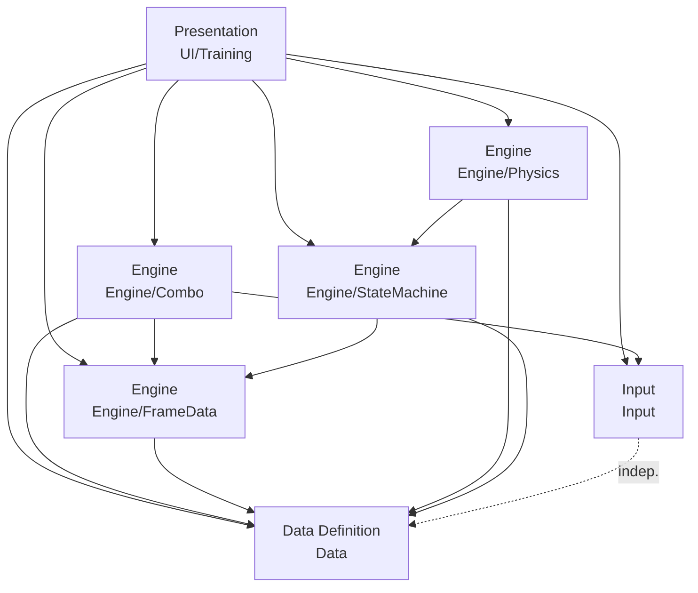
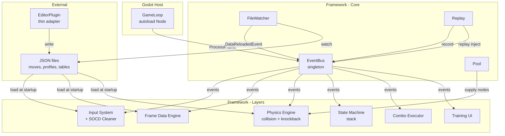

# Architecture Spine — FTG Framework V2

## Design Paradigm

**Layered Architecture, extended.** V2 carries V1's four layers forward and extends Engine with two new sub-layers. Cross-cutting infrastructure services (Replay, ObjectPool, FileWatcher) live in Core alongside EventBus — they are "used by all layers" and fit Core's definition. The EditorPlugin is a thin Godot adapter outside the framework namespace.



| Layer | Namespace | Role |
|-------|-----------|------|
| Presentation | `FTG_Framework.UI.Training` | Read-only observer; renders frame data panel, input log, combo counter |
| Engine | `FTG_Framework.Engine.FrameData`, `.Combo`, `.Physics`, `.StateMachine` | Game logic; frame timing, cancel detection, collision, knockback, state stack |
| Data Definition | `FTG_Framework.Data` | Pure data; move definitions, Gatling tables, KnockbackProfile, PhysicsResponseProfile — loaded from JSON, immutable after load |
| Input | `FTG_Framework.Input` | Input history, buffer, charge state, SOCD cleaning |

Shared: `FTG_Framework.Core` — EventBus, IModule, IPoolable, Pool, FileWatcher, Replay, base types. All layers reference Core.

## Inherited Invariants

V1 AD-1 through AD-8 remain binding. Amendments are noted inline; unlisted ADs carry forward unchanged.

| Inherited | From V1 spine | Status | Binds here |
|-----------|---------------|--------|------------|
| AD-1 — Layered Architecture | `architecture-ftg-framework-2026-07-15` | Carried forward | All V2 modules |
| AD-2 — Directory & Namespace Layout | `architecture-ftg-framework-2026-07-15` | Carried forward; directory tree extended | All V2 modules |
| AD-3 — Event-Driven Communication | `architecture-ftg-framework-2026-07-15` | Carried forward | All V2 modules |
| AD-4 — Frame Processing Order | `architecture-ftg-framework-2026-07-15` | **Amended** by AD-12 (V2 order replaces V1 order) | GameLoop, EventBus, all modules |
| AD-5 — EventBus Singleton | `architecture-ftg-framework-2026-07-15` | Carried forward | Core |
| AD-6 — Data Ownership | `architecture-ftg-framework-2026-07-15` | Carried forward; "restart required" clause superseded by AD-9 + AD-15 | Data layer, Engine layer |
| AD-7 — GameLoop Bridge | `architecture-ftg-framework-2026-07-15` | Carried forward | Godot integration |
| AD-8 — Fail-Fast Error Handling | `architecture-ftg-framework-2026-07-15` | Carried forward | All modules |

## Invariants & Rules

### AD-9 — Snapshot on Initiation

- **Binds:** all hot-reloadable data consumers (Physics, FrameDataEngine, ComboExecutor)
- **Prevents:** in-flight state corruption from mid-trajectory data changes; silent replay desync from hot-reloaded values
- **Rule:** All data hot-reloads affect only the next initiation event, never in-flight state. Knockback snapshots on `HitConnected`. Replay data versions snapshot on record start. Move frame data snapshots on `StartMove`. Gatling tables snapshot on combo start. A system that has already initiated with data version V must complete its lifecycle with version V, even if `DataReloadedEvent` arrives mid-lifecycle.

### AD-10 — Physics Engine Ownership

- **Binds:** Engine/Physics, Engine/FrameData, Engine/StateMachine
- **Prevents:** physics calculation leaking into Godot's physics server (non-deterministic); collision detection results bypassing EventBus
- **Rule:** `Engine/Physics` is the single owner of: collision detection (hitbox/hurtbox overlap), knockback force computation, gravity/friction application, and character position updates. It publishes `HitConnected` and `MoveBlocked` (moved from FrameDataEngine in V1). It reads `KnockbackProfile` from Data layer and `EffectivePhysicsProfile` from StateMachine — both read-only. Physics never writes to state; it only publishes events and updates positions.

### AD-11 — StateMachine / FrameDataEngine Peer Model

- **Binds:** Engine/StateMachine, Engine/FrameData
- **Prevents:** one engine subsystem owning another's lifecycle; StateMachine being derivative of frame data
- **Rule:** StateMachine and FrameDataEngine are peer collaborators via EventBus. Neither owns the other. StateMachine subscribes to `MoveStarted`, `MoveFrameChanged`, `HitConnected`, `MoveBlocked`, `MoveCanceled`, and `ComboEnded` to manage state transitions. FrameDataEngine has zero knowledge of states. StateMachine publishes `StateChanged` and `StateStackChanged`; Physics, Combo, and UI subscribe.

### AD-12 — V2 Frame Processing Order

- **Binds:** GameLoop, EventBus, all modules
- **Prevents:** non-deterministic event ordering; Physics missing same-frame HitConnected; StateMachine reacting before Physics has detected hits
- **Rule:** Within one `ProcessFrame()` call, events are dispatched in fixed order:
  0. Drain pending `DataReloadedEvent` (frame boundary — before any game logic)
  1. `FrameAdvanced`
  2. Input System events (`InputReceived`, `InputBufferExpired`, `ChargeStateChanged`)
  3. Frame Data Engine events (`MoveStarted`, `MoveFrameChanged`, `CancelWindowEntered`, `CancelWindowExited`)
  4. Physics events (`HitConnected`, `MoveBlocked`, `KnockbackApplied`)
  5. State Machine events (`StateChanged`, `StateStackChanged`)
  6. Combo System events (`ComboStarted`, `MoveCanceled`, `ComboEnded`)
  7. Host/lifecycle and UI events (`CharacterSelected`, `MatchInitialized`, scene and replay lifecycle events; read-only UI render)

  Within phase 3, `MoveStarted` is dispatched before the first `MoveFrameChanged` for the same move instance. Event-type order is part of the public deterministic contract and must not depend on subscriber registration or publication order. The numbered phases order envelopes that were queued before `ProcessFrame()` begins: GameLoop runs FrameData and Physics publishers before dispatch, so their events can be observed in their assigned phases of that frame. Dispatch is non-reentrant. Any event published by a subscriber while dispatch is active is stamped for the next frame, even when its type belongs to a later phase; no phase is reopened or drained twice. `DataReloadedEvent` is queued asynchronously by FileWatcher and drained synchronously at step 0.

### AD-13 — Replay Event-Stream Recording

- **Binds:** Core/Replay, EventBus, all modules
- **Prevents:** replay desync from missing events; data-version drift corrupting playback
- **Rule:** Deterministic Replay records the full EventBus envelope stream — every dispatched event with its frame, phase order, source epoch provenance, and schema version. During playback, the recorded stream is authoritative: live input and live publishers of recorded domain outcomes are suspended, envelopes are injected through the same phase dispatcher in recorded order, and subscribers consume them normally without regenerating a second copy. Replay reproduces the recorded result and therefore does not recompute Physics, StateMachine, or Combo outcomes from changed tuning data. Replay supports real-time playback and pause; frame-by-frame stepping and arbitrary seeking are out of V2 scope. Replay files carry a data-version tag (AD-9); deserialization refuses incompatible versions rather than silently corrupting playback.

  Core owns one complete `ReplayEventRegistry`. Every recordable event type has a stable discriminator, one versioned payload codec, and exactly one playback policy: `InjectAndApply` runs normal owner/subscriber mutation while suppressing derived publication already present in the stream; `OwnerApplyWithoutPublish` invokes the named owner-side applier for outcomes that replace suspended computation; `ObserveOnly` changes no authoritative state. Playback refuses a replay if its catalog is incomplete, unregistered, or contains an unknown type. A replay embeds an AD-20 initial state snapshot; playback restores it into a fresh epoch before the first envelope. Replay end retains the reproduced final state, allocates a fresh live epoch, and resumes publishers only after stale queues are discarded.

  The registry mapping is fixed by event class:

  | Recordable class | Events | Policy | Authoritative applier |
  |------------------|--------|--------|-----------------------|
  | Canonical input source | `InputReceived`, `InputBufferExpired`, `ChargeStateChanged` | `OwnerApplyWithoutPublish` | Input replay applier |
  | FrameData outcome | `MoveStarted`, `MoveFrameChanged`, cancel-window events | `OwnerApplyWithoutPublish` | FrameData replay applier; downstream mutation handlers run with derived publication suppressed |
  | Physics outcome | `HitConnected`, `MoveBlocked`, `KnockbackApplied` | `OwnerApplyWithoutPublish` | Physics replay applier; downstream StateMachine/Combo handlers run with derived publication suppressed |
  | Combo outcome | `ComboStarted`, `MoveCanceled`, `ComboEnded` | `OwnerApplyWithoutPublish` | Combo replay applier; downstream mutation handlers run with derived publication suppressed |
  | Derived state notification | `StateChanged`, `StateStackChanged` | `ObserveOnly` | None; causal outcomes already applied owner state |
  | Data/lifecycle/UI/debug notification | `DataReloaded`, replay/scene/match lifecycle, `StateRestored`, UI/debug events | `ObserveOnly` | None |

  Registry construction fails unless every recordable discriminator belongs to exactly one row and uses that row's policy/applier. `FrameAdvanced` is reconstructed from envelope frame boundaries by EventBus and is not independently replay-applied.

  `ReplayCodec` is the sole persistence authority. Its UTF-8 JSON container has a versioned header, initial snapshot, and an ordered envelope array containing stable event discriminator, frame, phase, within-phase sequence, source-epoch provenance, payload, and an integrity hash. Compatibility is exact-version or an explicit tested migration; an unknown event type, invalid order, failed hash, or unsupported version rejects the complete file.

  Training input playback (FR-26) is a separate input-only mode: it injects recorded canonical inputs and lets live systems re-simulate using the current dataset. FR-34's balance-testbed comparison uses training input playback when parameters change; full deterministic replay is used only for exact reproduction. The two modes are mutually exclusive within one lifecycle epoch.

### AD-14 — Object Pool Contract

- **Binds:** Core/Pool, all Node-instantiating consumers
- **Prevents:** GC spikes from frequent instantiation/destruction; `_Ready`/`_ExitTree` side effects on recycled nodes
- **Rule:** `IPoolable` defines `Reset()` — called on every acquire to restore the object to a clean state. `Pool<T> where T : Node, IPoolable` manages scene-tree attachment internally: `Acquire(Node parent)` calls `Reset()`, then adds to parent; `Release(T obj)` removes from parent, then returns to pool. Removal and reattachment may invoke Godot tree-exit/tree-enter lifecycle callbacks, so pooled nodes must tolerate repeated cycles and must not use those callbacks as one-time initialization. Pool lives in Core. Pooled types include projectiles, hit effects, and other frequently-created/destroyed visual nodes. **Exhaustion behavior:** exceeding configured capacity throws `InvalidOperationException` by default. A constructor parameter `autoExpand: true` enables automatic growth instead. **Double-release:** releasing an object not acquired from this pool throws `InvalidOperationException`.

### AD-15 — Hot-Reload Data Lifecycle

- **Binds:** Core/FileWatcher, Data layer, all hot-reloadable data consumers
- **Prevents:** partially-applied data changes within a frame; consumers reading stale data after a reload
- **Rule:** `FileWatcher` (thin wrapper around `System.IO.FileSystemWatcher` in Core) detects JSON file changes and queues `DataReloadedEvent` (carrying the changed file path). FileSystemWatcher callbacks run on OS background threads; FileWatcher must marshal the queued event to the main thread via a thread-safe queue drained by `EventBus.ProcessFrame()`. `EventBus.ProcessFrame()` drains pending reload events as step 0, before `FrameAdvanced`. Data layer reloads affected files synchronously during this step. By the time step 1 (`FrameAdvanced`) dispatches, all layers see the reloaded data — and each consumer snapshots on its own initiation event per AD-9. Runtime tuning writeback (CA-05) writes to JSON via Data layer; the write itself triggers the same FileWatcher → DataReloadedEvent path. **Hot-reload error handling:** a corrupted or unparseable JSON file detected during reload logs an error via FrameworkLog and retains the previous valid data — the framework does not crash mid-game (unlike startup-time AD-8 fail-fast).

### AD-16 — StateMachine Read-Only Physics API

- **Binds:** Engine/StateMachine, Engine/Physics
- **Prevents:** Physics coupling to state-stack internals; state traversal logic duplicating across consumers
- **Rule:** `IStateMachine` exposes `GetEffectivePhysicsProfile()` — the merged `PhysicsResponseProfile` from the full state stack. This is data aggregation (the StateMachine owns the per-state profiles and the merge logic), not physics computation. Physics calls this read-only each frame to obtain the effective profile, then multiplies by `KnockbackProfile` to compute actual forces. `IStateMachine` also exposes `CurrentState` (top of stack, for querying) and `GetStackDepth()`. Physics never writes state; StateMachine publishes `StateChanged` when the stack changes.

### AD-17 — Infrastructure in Core

- **Binds:** Core namespace
- **Prevents:** infrastructure services sprouting in Engine or UI layers; duplicate pool/file-watcher implementations
- **Rule:** Replay, ObjectPool (`Pool<T>`), and FileWatcher are Core services — all layers may reference them. They follow the same pattern as EventBus: plain C# classes, no Godot Node inheritance, singleton or instance-created-at-startup. EditorPlugin logic lives in pure C# services (behind interfaces) outside the framework namespace — the Godot EditorPlugin class is a thin adapter, analogous to GameLoop for runtime.

### AD-18 — Immutable State Boundaries and Generation Ownership

- **Binds:** Core/EventBus, Engine/StateMachine, Engine/Physics, Replay, training save/load
- **Prevents:** subscribers mutating framework-owned state; an old trajectory clearing a newer Hitstun occupancy; queued events from an earlier lifecycle affecting a later one
- **Rule:** EventBus is the sole lifecycle-epoch authority. It allocates a process-monotonic unsigned 64-bit epoch at match initialization, replay start/end, and successful state restoration, and stamps every queued envelope with the active epoch and frame at publication. Dispatch rejects an envelope whose epoch is not active. Replay and restore retain a serialized source epoch as provenance only; injected/restored work is stamped with the newly allocated active epoch. Public state-transition payloads are fully materialized at publication and transitively immutable: every reachable value is a primitive, enum, string, or immutable value object. `StateChanged` and `StateStackChanged` carry a canonical `StateStackSnapshot` of `CharacterState` values ordered bottom-to-top; an empty snapshot means no occupied state and resolves to the documented Idle fallback.

  Epoch and generation allocation are non-wrapping. Exhaustion is detected during reservation/increment before mutation, rejects the requested lifecycle transition or launch, logs a fatal diagnostic, and leaves the current epoch/session active. Physics owns one unsigned 64-bit generation counter per player and increments it before each accepted launch. `EventBus.ActivateReservedEpoch` atomically installs a prepared per-player generation high-water map: ordinary lifecycle transitions provide zeroed counters; restore and replay handoffs provide counters strictly greater than every rebound in-flight generation. Activation never performs a second reset after prepared Physics state is installed. `KnockbackApplied` carries `PlayerId`, `GenerationId`, `Phase` (`Started`, `Progressed`, `Completed`), world position, and frame; its envelope supplies `LifecycleEpoch`. Legal order for one tuple is exactly one `Started`, zero or more `Progressed`, then exactly one `Completed`; an exact duplicate is idempotently ignored and any other out-of-order phase is rejected. `Started` binds Hitstun occupancy to `(PlayerId, LifecycleEpoch, GenerationId)`. StateMachine rejects invalid player IDs and any partial or non-matching tuple before querying or mutating state. Only a matching `Completed` clears that occupancy.

  `StateStackChanged` emits the old and new canonical snapshots for every structural stack mutation. `StateChanged` emits old and new top-state values plus the new snapshot only when the top state changes. Each mutation is materialized and emitted separately; same-frame mutations are never coalesced.

### AD-19 — Explicit Physics Data Presence Semantics

- **Binds:** Data/physics JSON loaders, Engine/Physics, Core/FileWatcher, runtime tuning, EditorPlugin
- **Prevents:** omitted JSON fields silently becoming valid zero/default values; partially validated profile sets becoming observable; failed hot reload corrupting the last valid dataset
- **Rule:** Each persisted document type has one versioned canonical schema and one validator owned by Data and reused unchanged by startup, hot reload, runtime writeback, and EditorPlugin. Every physics document carries an explicit `schema_version`. `KnockbackProfile` requires `profile_id`, `horizontal`, `vertical`, `gravity`, and `friction`; `PhysicsResponseProfile` requires `profile_id`, `knockback_multiplier`, `gravity_scale`, `friction`, `air_friction`, and `participates_in_hitstop`. Identifiers are non-empty strings; numeric fields are finite non-negative framework-unit scalars with no implicit upper clamp; booleans must be explicitly present. Presence-aware parsing runs before immutable domain-object construction and rejects nulls, duplicate property names, numeric/string coercion, unknown required-version semantics, and values outside these domains.

  The transaction root is the logical physics dataset: the changed versioned document plus the current move and state-profile references that depend on it. The validator rejects duplicate IDs and dangling references across that candidate before any swap. Each external FileWatcher change is one single-file candidate transaction against the currently committed dataset, coalesced by canonical path and content version and processed once in deterministic canonical-path order. A change that requires multiple files to become valid together must use the Data transaction API, which validates all staged files and publishes one dataset version; watcher timing or burst grouping is never an atomicity mechanism. Startup, hot reload, and ordinary writeback accept only the current schema version. An explicit migration command validates the declared source version, applies the ordered migration registry to the one current target version, validates the target, and atomically writes it; migrated values are never applied only in memory. Startup follows AD-8 and fails fast. Hot reload and writeback atomically swap the complete validated candidate and retain the previous valid dataset on failure. Ordinary deserialization never migrates or synthesizes defaults.

### AD-20 — Versioned, Failure-Atomic State Snapshots

- **Binds:** Core/state snapshot coordinator, Core/EventBus, training save/load, Replay, Engine/StateMachine, Engine/FrameData, Engine/Physics, Input
- **Prevents:** restoring partial state; serializing mutable implementation containers; accepting incompatible snapshots; observer-visible intermediate state; pre-restore events mutating restored state
- **Rule:** Core owns one state snapshot coordinator and its deterministic participant order. A training snapshot is a versioned DTO containing `schema_version`, `framework_version`, source epoch provenance, frame identity, and component-owned value snapshots. It never serializes concrete stacks, mutable arrays or dictionaries, Godot objects, or internal engine objects directly. Capture occurs at a named frame boundary under the coordinator's quiescence barrier; all participant snapshots carry the same frame and active epoch.

  Every snapshot participant registers one stable component discriminator and one versioned payload codec with the coordinator. Only the owning participant decodes and migrates its component payload; the coordinator validates container metadata, unique discriminators, supported component versions, and cross-component identities. Load uses `Prepare` then `Commit`. The barrier pauses GameLoop advancement and EventBus dispatch, waits for in-progress producers, and quarantines newly queued work. During Prepare, EventBus reserves—but does not activate—one fresh epoch. Each participant validates references and allocates an immutable prepared replacement without mutating live state. Restored lifecycle-bound identities are rebound to the reserved epoch; in-flight generation values are preserved within each player, and the prepared Physics counter is strictly greater than every restored generation for that player. After all participants prepare, the coordinator validates one immutable cross-component graph for shared character IDs, frame, reserved epoch, move instances, trajectories, state stacks, recordings, and data references. Every fallible operation completes before commit.

  `frame` is the last fully completed AD-12 frame represented by the snapshot. Commit performs deterministic no-fail state-reference swaps and calls `ActivateReservedEpoch(preparedHighWaterMap)` as part of the same no-fail boundary, with observer notifications suppressed. If prepare fails, prepared values and the epoch reservation are discarded, quarantined work is released against the unchanged epoch, and live state was never mutated. On successful normal restore, EventBus discards all old-epoch and quarantined envelopes, dispatches exactly one observe-only `StateRestored` host/lifecycle event in phase 7 under the new epoch while still quiesced, then resumes with the next `ProcessFrame()` producing `FrameAdvanced(frame + 1)`. Publication from a `StateRestored` subscriber is prohibited and rejected.

  Replay bootstrap uses the same prepare/commit machinery through a non-observable preparation channel: it suppresses `StateRestored`, which is neither recorded nor expected as the first replay envelope. Replay end also uses the coordinator's reserved-epoch rebind/high-water commit protocol, preserving final in-flight trajectories and state occupancies while rebinding them to the fresh live epoch. An implementation that can throw after the first live-state swap is non-compliant. Unsupported schema versions are rejected unless an explicit tested migration exists. Unknown optional fields may be ignored only within a compatible schema version; missing required fields are rejected.

## Adoption Gate

AD-9 through AD-17 describe the V2 foundation, but the table below identifies contracts that are only partial or amended. The 2026-07-31 correction is a target contract and must be implemented before V2 Epic 2 starts:

| Decision | Current reality | Gate evidence |
|----------|-----------------|---------------|
| AD-12 Phase 3 amendment | Accepted in PREP-2.3 | [Slice 1 event/lifecycle evidence](../../../implementation-artifacts/evidence/v2-prep-2-3/slice-1-event-lifecycle/manifest.md) |
| AD-13 | Corrected and accepted in PREP-2.3 | [Slice 4 replay/runtime evidence](../../../implementation-artifacts/evidence/v2-prep-2-3/slice-4-runtime-audit/manifest.md) |
| AD-15 | Corrected and accepted in PREP-2.3 | [Slice 2 transactional-data evidence](../../../implementation-artifacts/evidence/v2-prep-2-3/slice-2-transactional-data/manifest.md) |
| AD-18 | Corrected and accepted in PREP-2.3 | [Slice 1 immutable boundary](../../../implementation-artifacts/evidence/v2-prep-2-3/slice-1-event-lifecycle/manifest.md) and [Slice 3 lifecycle restore](../../../implementation-artifacts/evidence/v2-prep-2-3/slice-3-snapshot-foundation/manifest.md) |
| AD-19 | Corrected and accepted in PREP-2.3 | [Slice 2 presence-aware schema evidence](../../../implementation-artifacts/evidence/v2-prep-2-3/slice-2-transactional-data/manifest.md) |
| AD-20 | Implemented and accepted in PREP-2.3 | [Slice 3 snapshot evidence](../../../implementation-artifacts/evidence/v2-prep-2-3/slice-3-snapshot-foundation/manifest.md) |

Until a row's evidence exists, downstream stories must treat that decision as a required dependency, not as an available capability.

## Consistency Conventions

| Concern | Convention |
|---------|------------|
| Naming | C# standard: PascalCase types/methods/properties, camelCase locals/params, `_camelCase` private fields |
| Interfaces | Cross-module engine contracts use interfaces in Core or their owning Core subnamespace (e.g., `IPhysicsEngine`, `IStateMachine`, replay contracts). Runtime implementations behind those contracts are `internal` where host construction permits; public data values, ViewModels, and infrastructure entry points are explicit exceptions. Dependencies are supplied at startup rather than service-located. |
| Data immutability | Data layer objects use `init`-only properties. Once constructed by `MoveDataLoader`, no field is writable. KnockbackProfile and PhysicsResponseProfile follow the same immutability rule. |
| JSON | `System.Text.Json` (built-in .NET). No external JSON library. Persisted field names use `snake_case`; Data owns the canonical naming policy and schemas. |
| Event types | Plain `readonly record struct` payloads in Core namespaces. No inheritance — each event is a distinct type. EventBus envelopes own frame and lifecycle-epoch metadata; payloads carry only domain fields. Critical payload fields (e.g., `HitConnected.AttackerId`, `HitConnected.DefenderId`, `HitConnected.MoveId`) are versioned contracts and must not be removed or renamed without migration. State payloads additionally obey AD-18. |
| Error messages | English, prefixed with module name: `[Physics] Invalid knockback vector: (-inf, 0)`. |
| ViewModel-first UI | All Godot Control nodes backed by pure-C# ViewModels testable under `dotnet test`. No game logic in `_Process` or `_Ready` of Control-derived classes. |
| EditorPlugin thinness | EditorPlugin classes contain only Godot editor API calls. All business logic (validation, JSON serialization, move editing) lives in pure C# services behind interfaces. |
| Poolable nodes | Any Godot Node type used with `Pool<T>` must implement `IPoolable`. `Reset()` must restore all mutable state; `_Ready` must be safe to call exactly once. |

## Stack

| Name | Version | Role |
|------|---------|------|
| Godot .NET SDK | 4.5.1 (checked-in package pin) | Engine/platform |
| C# target frameworks | `net8.0`; Android `net9.0` | Runtime targets |
| .NET SDK | 10.x for the checked-in build and scaffold toolchain | Build/scaffold SDK |
| System.Text.Json | built-in (.NET) | JSON deserialization |
| System.IO.FileSystemWatcher | built-in (.NET) | Hot-reload file change detection |
| Godot UI (Control nodes) | Godot 4.x built-in | Training mode widget rendering |

No external NuGet packages for framework runtime. V2 adds no new dependencies beyond .NET built-ins. Test-only dependencies (xUnit/NUnit, assertion libraries) are excluded from this claim.

## Structural Seed



```text
Scripts/Framework/
  Core/                    # EventBus, IModule, IPoolable, Pool<T>, FileWatcher, Replay, base types
  Input/                   # InputBuffer, InputHistory, ChargeTracker, SOCDCleaner
  Data/                    # MoveDefinition, GatlingTable, KnockbackProfile, PhysicsResponseProfile, MoveDataLoader
  Engine/
    FrameData/             # FrameDataEngine, CancelWindowTracker, MoveTimeline
    Combo/                 # ComboExecutor, ChainValidator, ComboStateTracker
    Physics/               # PhysicsEngine, CollisionDetector, ForceCalculator
    StateMachine/          # StateMachine, StateStack, StateFactory
  UI/
    Training/              # FrameDataPanel, AdvantageDisplay, InputLog, PlaybackControls, ComboCounter

Scripts/Editor/            # EditorPlugin thin adapter (outside framework namespace)
```

## Event Catalog (V2)

| Event | Publisher | Subscribers | Change from V1 |
|-------|-----------|-------------|----------------|
| `FrameAdvanced` | EventBus | Input, FrameData, Physics, StateMachine, Combo, UI | — |
| `InputReceived` | Input System | Combo, StateMachine, UI | — |
| `InputBufferExpired` | Input System | Combo | — |
| `ChargeStateChanged` | Input System | Combo | — |
| `MoveStarted` | FrameDataEngine | StateMachine, Combo, UI | New |
| `MoveFrameChanged` | FrameDataEngine | StateMachine, Combo, UI | — |
| `CancelWindowEntered` | FrameDataEngine | Combo, UI | — |
| `CancelWindowExited` | FrameDataEngine | Combo, UI | — |
| `HitConnected` | **Physics** | StateMachine, Combo, UI | Publisher moved from FrameDataEngine |
| `MoveBlocked` | **Physics** | StateMachine, Combo, UI | Publisher moved from FrameDataEngine |
| `KnockbackApplied` | Physics | StateMachine, UI | New; generation-bearing `Started`/`Progressed`/`Completed` event governed by AD-18 |
| `StateChanged` | StateMachine | Physics, Combo, UI | New; carries publication-time immutable state snapshot |
| `StateStackChanged` | StateMachine | Physics, UI | New; carries canonical bottom-to-top `StateStackSnapshot` |
| `ComboStarted` | ComboExecutor | StateMachine, UI | — |
| `MoveCanceled` | ComboExecutor | FrameDataEngine, StateMachine, UI | Subscribers extended |
| `ComboEnded` | ComboExecutor | StateMachine, UI | Subscribers extended |
| `DataReloaded` | FileWatcher (Core) | Data, Physics, FrameDataEngine | New |
| `ReplayStarted` | Replay (Core) | All modules | New |
| `ReplayEnded` | Replay (Core) | All modules | New |
| `ReplayPaused` | Replay (Core) | UI | New |
| `CharacterSelected` / `MatchInitialized` | UI/Scene host | Core, scene consumers | New lifecycle/host events |
| `SceneChanging` / `SceneChanged` | SceneManager (Core) | Registered scene consumers | New lifecycle/host events |
| `StateRestored` | State snapshot coordinator (Core) | lifecycle observers, UI | New; sole post-commit restore result in phase 7 |

## Capability → Architecture Map

| FR | Capability | Lives in | Governed by |
|----|-----------|----------|-------------|
| FR-16 | Hitbox/hurtbox collision detection | `Engine/Physics/` | AD-10, AD-12 |
| FR-17 | Knockback system (force, gravity, friction) | `Engine/Physics/` + `Data/` | AD-10, AD-9, AD-18, AD-19 |
| FR-18 | PhysicsResponseProfile per state | `Data/` + `Engine/StateMachine/` | AD-16, AD-6, AD-19 |
| FR-19 | Physics parameter hot-reload | `Data/` + `Core/` | AD-15, AD-9, AD-19 |
| FR-20 | Stack-based state machine | `Engine/StateMachine/` | AD-11, AD-18 |
| FR-21 | Per-state PhysicsResponseProfile association | `Engine/StateMachine/` | AD-16, AD-3 |
| FR-22 | Godot character scene template | `Scripts/Editor/` | EditorPlugin thinness convention |
| FR-23 | EditorPlugin move authoring | `Data/` + `Scripts/Editor/` | AD-6, AD-15 |
| FR-24 | Runtime tuning with JSON writeback | `Data/` + `UI/Training/` | AD-15, AD-9, AD-19 |
| FR-25 | Combo counter + damage display | `UI/Training/` | AD-3 (subscribe only) |
| FR-26 | Input recording & playback | `Input/` + `UI/Training/` | AD-3, AD-12, AD-18 |
| FR-27 | Training state save/load | `UI/Training/` + `Core/` | AD-18, AD-20 |
| FR-28 | Deterministic replay system | `Core/` | AD-13, AD-9, AD-12, AD-18 |
| FR-29 | Object pool | `Core/` | AD-14, AD-17 |
| FR-30 | SOCD cleaning | `Input/` | AD-1 (Input layer) |
| FR-31 | Character select system | `Data/` + `UI/` | AD-3, AD-6 |
| FR-32 | Project template / one-click install | `Scripts/Editor/` | EditorPlugin thinness convention |
| FR-33 | EventBus debug panel | `Scripts/Editor/` | AD-3 |
| FR-34 | Runtime tuning × Replay × Input recording | Cross-cutting | AD-9, AD-13, AD-15, AD-18, AD-19 |
| FR-35 | State stack × Save/Load × Replay | Cross-cutting | AD-11, AD-13, AD-16, AD-18, AD-20 |
| FR-36 | EditorPlugin × Debug panel × Runtime tuning | Cross-cutting | AD-15, AD-19, EditorPlugin thinness convention |

## Deferred

- **Per-move input buffer overrides** — V1 global buffer remains. Per-move configuration adds design complexity without immediate training-mode value.
- **Hitbox/hurtbox visual editor (per-frame)** — Aspirational. Requires editor-side sprite overlay editing; deferred until authoring pipeline is stable.
- **UI theme depth** — V1 position/size/color/font customization is sufficient. Rich theming/skinning deferred.
- **Example project with full playable demo** — Requires V2 completion + art assets. Built last.
- **Auto-combo route finder + infinite detection** — Green-hat idea. Requires full roster + move data; deferred until all core systems are stable.
- **Move timeline visualizer (drag-and-drop)** — Green-hat idea. High UI complexity; deferred.
- **Replay frame-by-frame stepping and seeking** — Requires per-frame full-state snapshots or re-simulation. Out of V2 scope.
- **Non-physics move-data field inventory** — Exact fields and domain constraints outside the physics-profile contract remain owned by Data. Validation authority, versioning, presence semantics, compatibility policy, and cross-document atomicity are not deferred; they follow AD-19.
